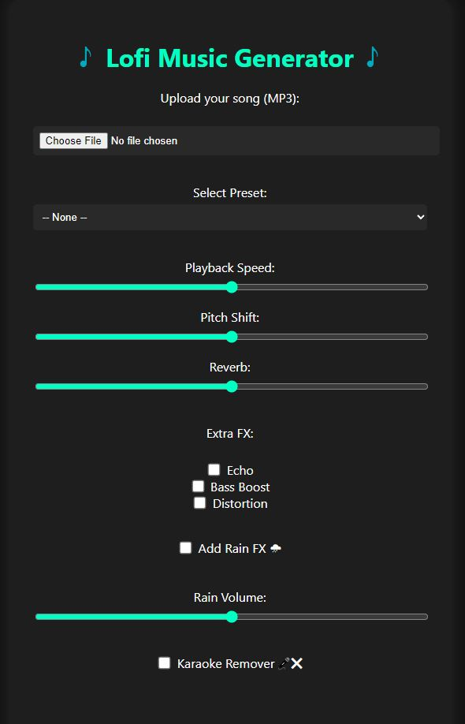

# 🎵 Lofi Generator

Turn any MP3 into a smooth lofi track with customizable presets, pitch shifting, reverb, rain effects, karaoke remover, and more—all through an intuitive web interface.



## ✨ Features

- Upload your own MP3 file
- Choose between presets: Chill, Vintage, Deep Night
- Adjust:
  - Playback speed
  - Pitch shift
  - Reverb intensity
  - Output volume
- Toggle additional effects:
  - Echo
  - Bass Boost
  - Distortion
- Add Rain Sound FX with adjustable volume
- Karaoke Vocal Remover
- Optional lyric input with "Lyrics Only" display
- Audio preview & export final lofi track

## 🚀 How to Run

1. **Clone the repository**
   ```bash
   git clone https://github.com/your-username/lofi-generator.git
   cd lofi-generator
   ```

2. **Install dependencies**
   ```bash
   pip install -r requirements.txt
   ```

3. **Run the app**
   ```bash
   python app.py
   ```

4. **Access it**
   Open your browser and go to [http://localhost:5000](http://localhost:5000)

## 📁 Project Structure

```
root/
├── app.py
├── templates/
│   └── index.html
├── static/
│   └── style.css
├── ui_preview.jpg  ← ← ← (Make sure this is added here)
├── requirements.txt
└── README.md
```

## 📦 Dependencies

Ensure your `requirements.txt` includes:
```txt
Flask
Werkzeug
pydub
librosa
soundfile
```

## ⬇️ Download

After generating your lofi track, click the button below to download your final version:

[⬇️ Download Final Track](/download/{{ download_file }})
